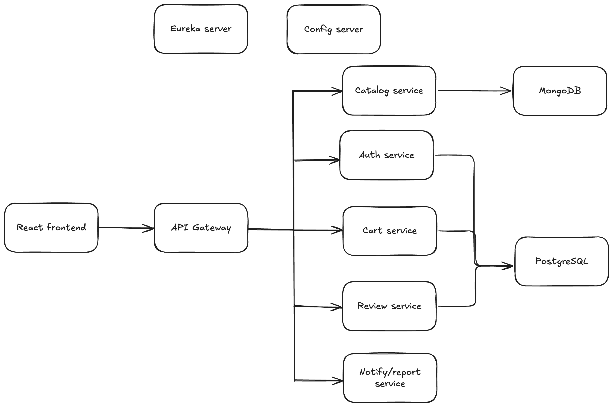

# Bookstore - Aplicación de Microservicios

Esta es una aplicación e-commerce de una librería construida utilizando una arquitectura de microservicios. El backend está desarrollado con Spring Boot y el frontend con React.

## Arquitectura

El sistema está compuesto por varios microservicios que se comunican entre sí a través de un API Gateway. Eureka se utiliza para el descubrimiento de servicios y un Servidor de Configuración centraliza la configuración de todos los servicios.



## Tecnologías Utilizadas

- **Backend:** Spring Boot, Spring Cloud, Spring Security, JWT
- **Frontend:** React, Vite, Axios
- **Bases de Datos:** PostgreSQL, MongoDB
- **Infraestructura:** Docker, Docker Compose, Eureka, Spring Cloud Config
- **Comunicación:** REST APIs, Feign Client

## Características

- Autenticación y autorización de usuarios con roles.
- Catálogo de libros.
- Carrito de compras.
- Historial de compras.
- Sistema de reseñas de libros.
- Notificaciones por correo electrónico para compras.
- Panel de administración para la gestión de usuarios.

## Prerrequisitos

- Docker
- Docker Compose

## Cómo Empezar

Sigue estos pasos para levantar el entorno de desarrollo local.

1.  **Clona el repositorio:**
    ```bash
    git clone https://github.com/AneuryEstevez/bookstore.git
    cd bookstore
    ```

2.  **Configura las variables de entorno:**
    Crea un archivo `.env` en la raíz del proyecto copiando el archivo `env.example`.
    ```bash
    cp env.example .env
    ```
    Abre el archivo `.env` y reemplaza los valores de las variables:

    -   `JWT_SECRET`: Una clave secreta para la generación de tokens JWT.
    -   `VITE_PAYPAL_CLIENT_ID`: ID de cliente de PayPal para procesar los pagos.
    -   `MAIL_USERNAME`: Tu dirección de correo electrónico de Gmail para enviar notificaciones.
    -   `MAIL_PASSWORD`: La contraseña de aplicación de tu cuenta de Gmail.

3.  **Levanta los servicios con Docker Compose:**
    ```bash
    docker-compose up --build
    ```
    Este comando construirá las imágenes de los contenedores y los iniciará.

4.  **Accede a las aplicaciones:**
    -   **Frontend:** `http://localhost:5173`
    -   **API Gateway:** `http://localhost:8080`
    -   **Eureka Server:** `http://localhost:8761`
    -   **Config Server:** `http://localhost:8888`

## Descripción de los Servicios

| Servicio                | Puerto | Descripción                                                                    |
| ----------------------- | ------ | ------------------------------------------------------------------------------ |
| `frontend`              | 5173   | Aplicación de React que consume el API Gateway.                                |
| `api-gateway`           | 8080   | Punto de entrada único para todas las peticiones de la API.                    |
| `config-server`         | 8888   | Gestiona la configuración centralizada para todos los servicios.               |
| `eureka-server`         | 8761   | Permite el descubrimiento de servicios en la red.                              |
| `auth-service`          | -      | Gestiona la autenticación, autorización y gestión de usuarios.                 |
| `catalog-service`       | -      | Proporciona información sobre los libros disponibles.                          |
| `cart-service`          | -      | Gestiona el carrito de la compra y el proceso de checkout.                     |
| `review-service`        | -      | Permite a los usuarios añadir y ver reseñas de los libros.                     |
| `notify-report-service` | -      | Envía notificaciones (ej. confirmación de compra) y genera reportes.           |
| `mongodb`               | 27017  | Base de datos NoSQL para el `catalog-service`.                                 |
| `db` (PostgreSQL)       | 5432   | Base de datos SQL para los servicios de autenticación, carrito y reseñas.       |